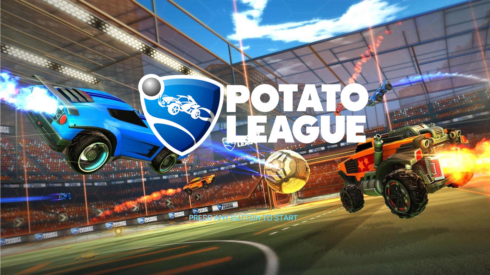
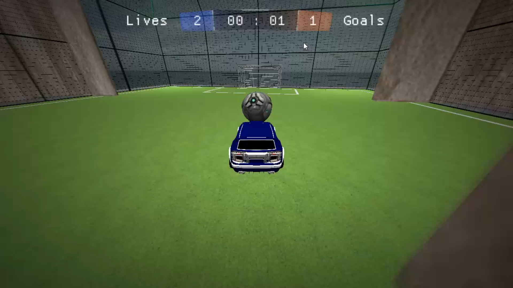
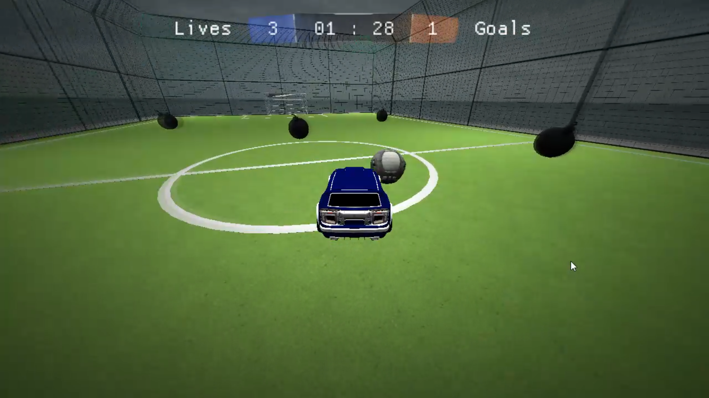
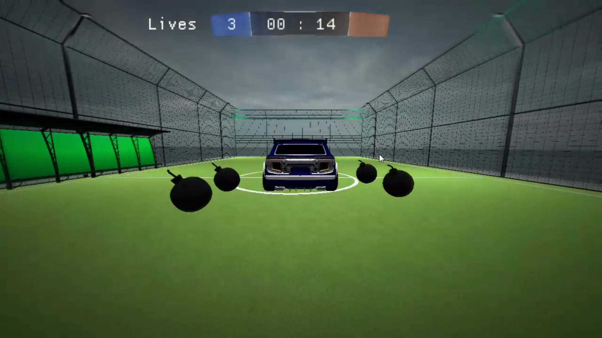
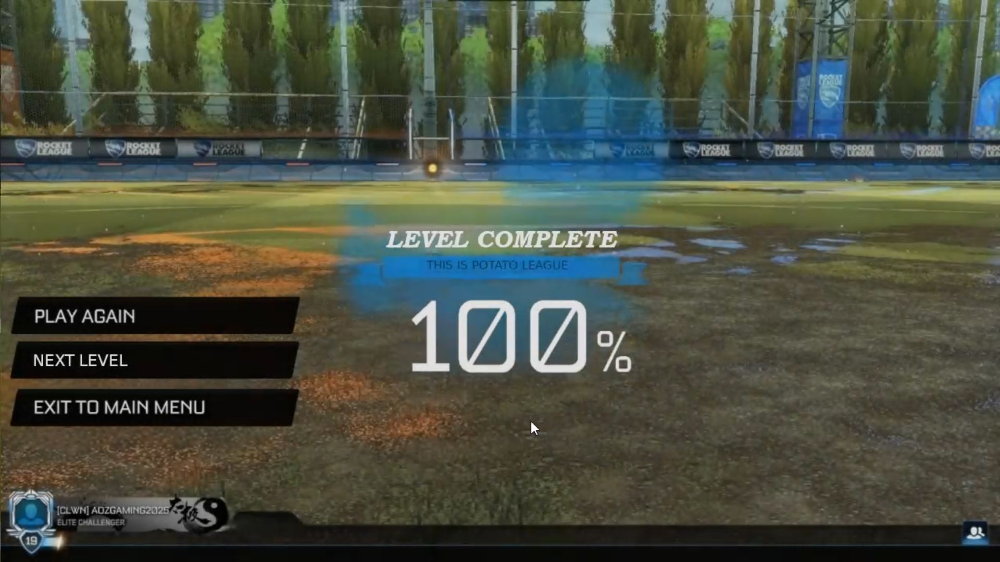
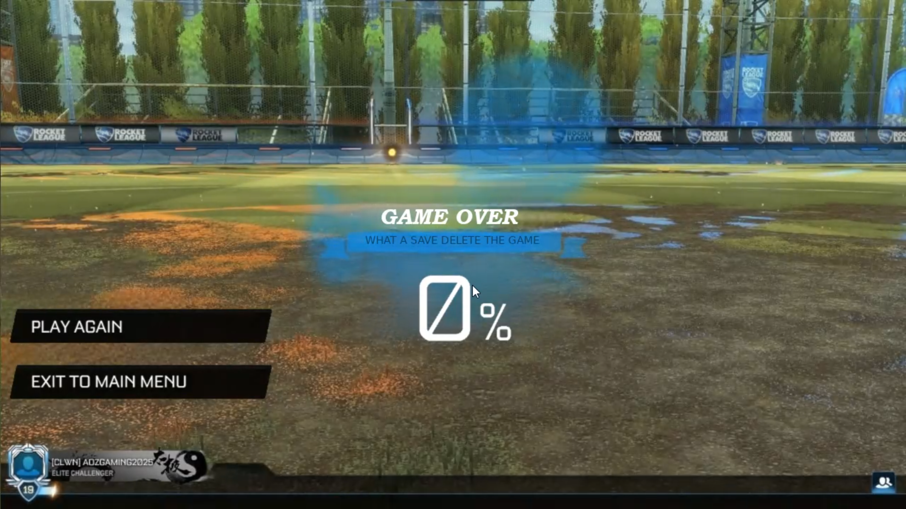

# Overview
Welcome to our 3D Game Engine project! Our engine includes a variety of features such as a simple physics engine, support for animations and lighting, customizable level creation, and the ability to read object files and materials.

beside the engine we have created a rockect-league clone using this game engine we will introduce it later on.

# Game Engine Features
## Physics Engine
Simple Collision Detection: Utilizes the Separating Axis Theorem (SAT) for efficient collision detection and approximations.
## Animation
Shader-Based Animations: Supports animations through the use of shaders, allowing for smooth and realistic movement of objects.
## Lighting
Implements Blinn-Phong shading to simulate various light sources, including:
 - Point Lights
 - Directional Lights
 - Cone Lights
# Level Creation
Customizable Levels: Levels can be created and customized using configuration files in JSON format, making it easy to design and modify game environments.
Object and Material Support
# File Reading Capabilities
The engine can read object files (.obj) and associated materials, allowing for detailed and textured 3D models.

---

# Potato League 
a game that is clone of the famous game "Rocket League" that introduces 4 different levels with different contents that is suitable for a single player.

the game supports different types of mechanics like 
1. moving the car across the field 
2. different set of collisions
    - car with ball, obstacles and walls
    - ball with obstacles, walls and the goal
3. jumping with the car - using right click - 
4. boosting with the car - using left click -
5. scoring and count down system
6. menus used for navigation between levels
7. cool sound tracks 

## Images From The Game
| | |
| --- | --- |
|  
level 1
|  
level 2
|
|  
level 3
|  
level 4
|
|  
Winning Screen
|  
Losing Screen
|

## Download 
you can download and try the game. what are you waiting it's free 
[play now](https://drive.google.com/file/d/1evlm-RldDfix9a3eADACGUq1K2fUbfeW/view?usp=sharing)

## Prerequisites - For The Game Engine Only Not The Game -
- Compiler: Ensure you have a C++ compiler installed (e.g., GCC, Clang).
- Graphics Library: This engine relies on OpenGL for rendering, so you need to have the appropriate libraries installed on your system.
- CMake: A cross-platform tool to manage the build process.

## Installation
1. Clone the Repository
2. Build the Project
3. Define your level configuration in a JSON file. Refer to config/level1.json for guidance.

Acknowledgements
Thanks to the open-source community for providing invaluable resources and tools.
Thanks to contributors who have helped improve this project.
Special thanks to dr. Yehia for the guidance and leading the way for this project
